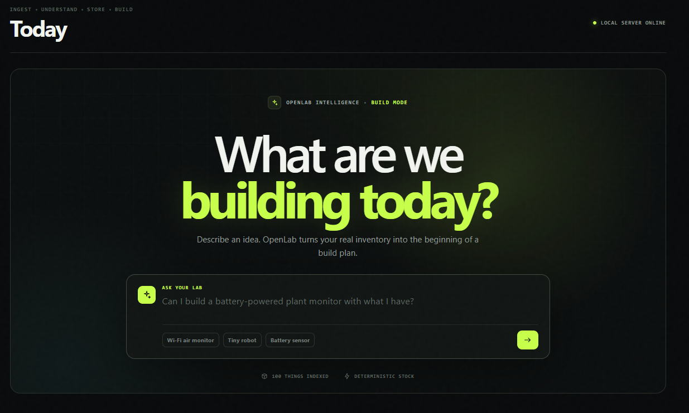
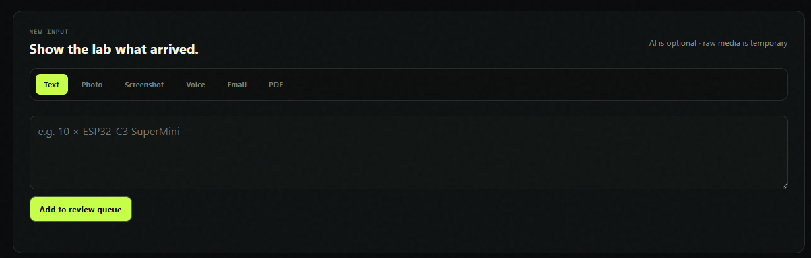
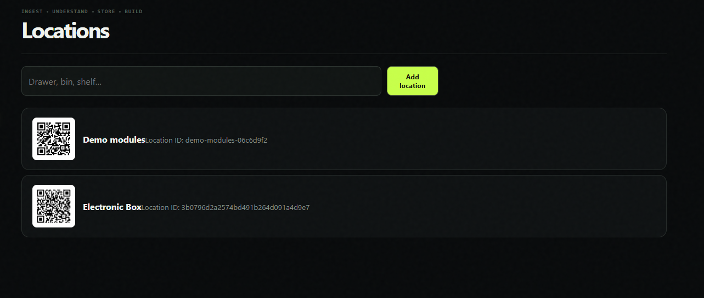
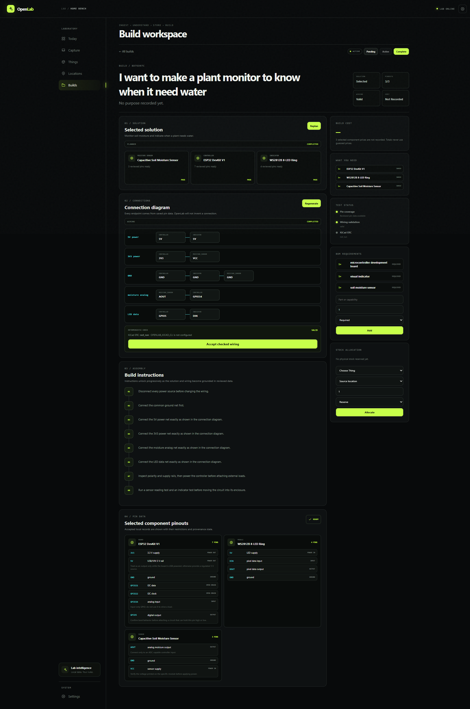

# OpenLab

### Stop cataloguing parts. Start building with them.

OpenLab is a local-first workspace for electronics labs. Capture what arrived, review what the model understood, find every component by drawer, and turn the stock you actually own into a practical build plan.

<p align="center">
  <a href="https://github.com/Lem0nTree/openlab/stargazers"><strong>⭐ Star OpenLab if you want a smarter, self-hosted lab bench</strong></a>
</p>



## From “what is in this box?” to “what can I build?”

OpenLab connects the parts of lab work that normally live in separate apps, spreadsheets, and memory:

1. **Capture** — add text, photos, screenshots, voice recordings, or PDFs to one review queue.
2. **Understand** — optionally use any compatible local or hosted AI model to propose identities while preserving confidence and provenance.
3. **Store** — confirm every inventory write yourself, track stock movements, and print QR labels for drawers, bins, and shelves.
4. **Build** — describe an idea and get bounded solutions based on available stock, reviewed pin data, and explicit missing components.

| Capture what arrived | Put it in the right place |
| --- | --- |
|  |  |

## What makes OpenLab different

- **Review-first Smart Inbox** — model output never becomes stock until a person confirms it.
- **Bring your own intelligence** — connect OpenAI, OpenRouter, Ollama, LM Studio, vLLM, or another `/v1`-compatible endpoint; AI stays optional.
- **Inventory with a physical memory** — hierarchical locations, QR labels, balances, receipts, moves, usage, and an auditable movement history.
- **Inventory-grounded BUILD** — search by capability, compare owned-item combinations, expose missing requirements, and allocate real stock deliberately.
- **Safer wiring proposals** — sourced pin records, deterministic electrical checks, downloadable KiCad schematics, and optional `kicad-cli` ERC.
- **Local-first deployment** — run the full stack with Docker Compose, with an optional [CI-gated ARM64 build-to-Pi path](docs/AUTOMATIC_DEPLOYMENT.md).



## How it compares

OpenLab is built for the maker who wants to move from messy bench intake to a build grounded in real inventory. Other excellent tools optimize for different jobs:

| Product | Best fit | Intake workflow | Build workflow | Hosting |
| --- | --- | --- | --- | --- |
| **OpenLab** | Electronics labs that want one capture-to-build loop | Review-first text, photo, screenshot, voice, and PDF capture | Proposes solutions from owned stock, then checks recorded pins and wiring | Self-hosted Docker |
| [Part-DB](https://docs.part-db.de/) | Deep component cataloguing and traditional project BOMs | Barcode scanning, imports, and supplier/shop enrichment | BOM buildability counts and component withdrawal | Self-hosted web app |
| [InvenTree](https://inventree.org/) | Structured business inventory and manufacturing | Extensible APIs, imports, and plugins | Multi-level BOMs, build orders, allocation, and disassembly | Open-source and self-hosted |
| [Binner](https://binner.io/features) | Maker inventory with distributor integrations | Barcodes, order imports, and automatic part metadata | Project BOM tracking | Self-hosted or hosted cloud |

OpenLab is not trying to replace a full ERP or procurement suite. It is the shortest path from **“this arrived”** to **“I can build this safely with what I have.”**

## Start your lab

You need Docker with Compose. From the repository root:

```bash
git clone https://github.com/Lem0nTree/openlab.git
cd openlab
sh deploy/up.sh --build
```

Open [http://localhost:3000](http://localhost:3000), copy the one-time setup token printed by `openlab-server`, and create the owner account. OpenLab generates missing secrets on first run and preserves existing values and persistent volumes across restarts.

To stop the stack without deleting your data:

```bash
docker compose --env-file .env -f deploy/compose.yml down
```

### Configure optional AI

Go to **Settings → Smart Inbox**, select a preset or compatible endpoint, choose a model, and decide whether processing is enabled. OpenLab clearly marks local versus external processing; provider keys are encrypted and never returned through the API.

See [Smart Inbox](docs/MVP1_SMART_INBOX.md), [item intelligence and BUILD](docs/ITEM_INTELLIGENCE.md), and [remaining scope](docs/REMAINING_FEATURES.md) for the exact current contract and roadmap.

## Project map

- `backend/` — FastAPI API, PostgreSQL worker, migrations, and tests
- `web/` — responsive Next.js PWA and generated OpenAPI types
- `deploy/` — Docker Compose, images, secret bootstrap, backup, and restore tools
- `screen/` — current product screenshots

OpenLab is under active development and licensed under [Apache 2.0](LICENSE). Contributions and honest field reports are welcome.

<p align="center">
  <strong>Own your lab data. Know your stock. Build more.</strong><br />
  <a href="https://github.com/Lem0nTree/openlab/stargazers">⭐ Give OpenLab a star</a> · <a href="https://github.com/Lem0nTree/openlab/issues">Share an idea</a>
</p>
